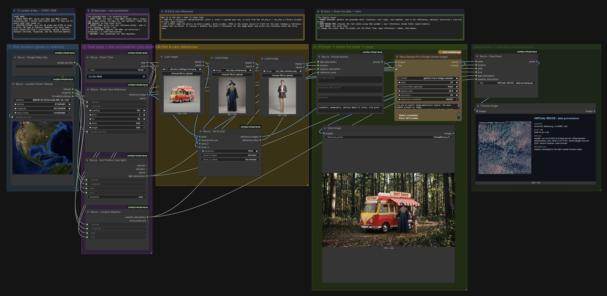
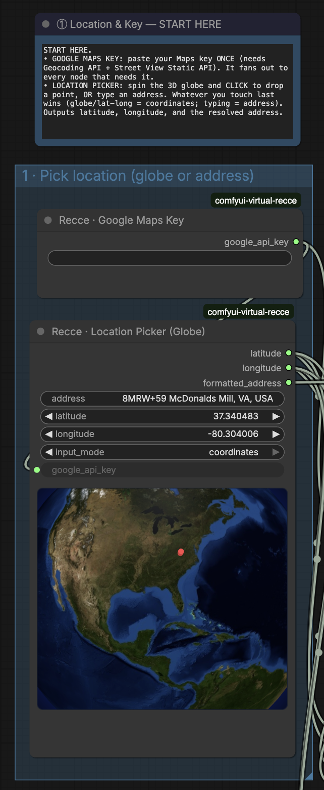
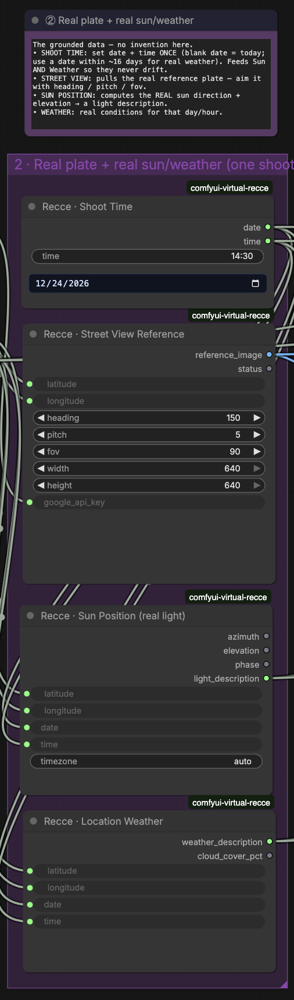
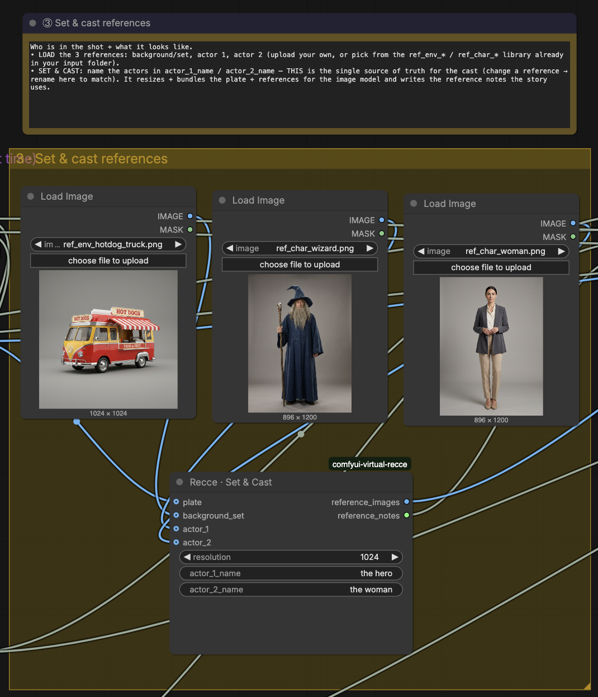
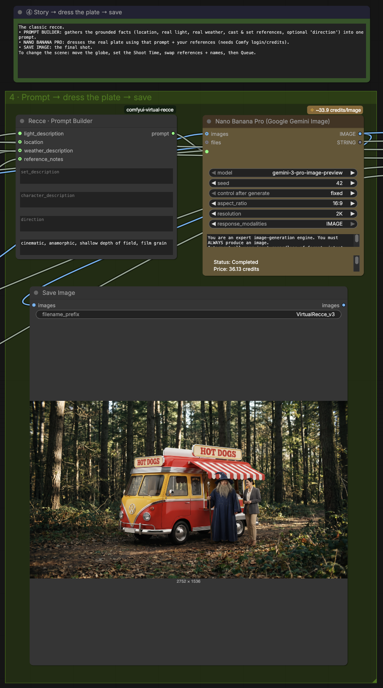
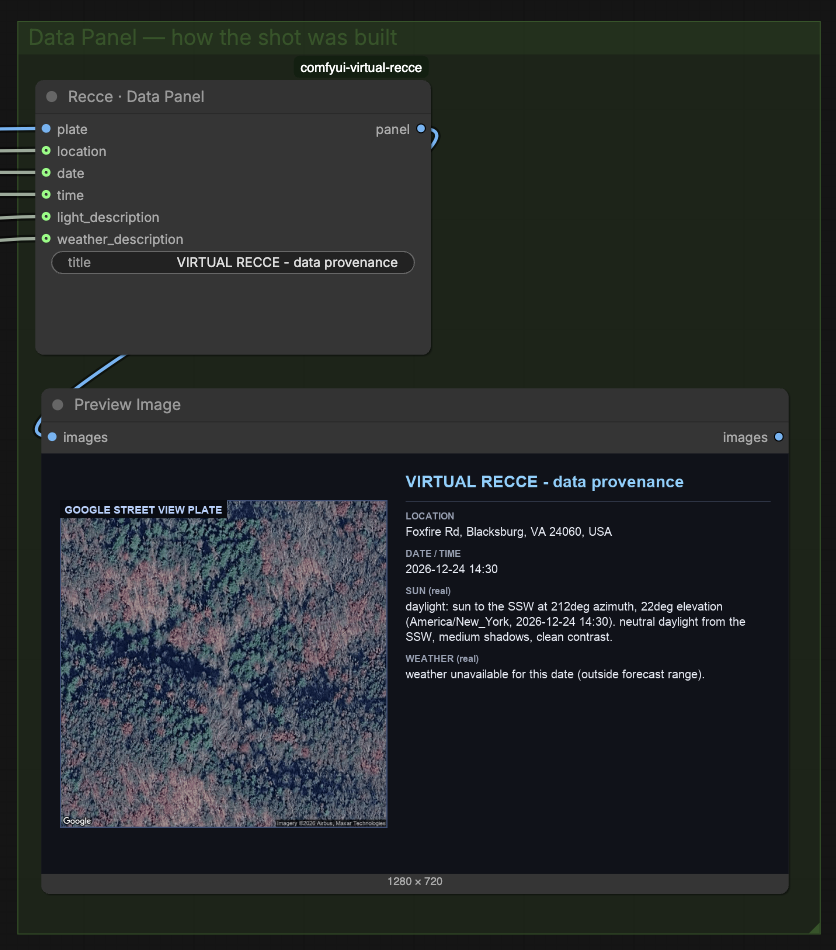

# Virtual Recce

**Virtual Recce** is a ComfyUI custom-node pack for **data-grounded location scouting**. Drop a pin anywhere on Earth and it assembles a cinematic shot grounded in *real* data: a real Google **Street View** plate, the **real sun position** for your date and time, the **real weather**, plus your **set and cast** references — then dresses the plate with an AI image model. It also renders a **data-provenance card** so it is always clear exactly how a shot was built.



## Start here

Read **[WORKFLOW_GUIDE.md](WORKFLOW_GUIDE.md)** before opening the workflow — requirements, install, credentials, operation, limitations, and troubleshooting.

## What it does

- **Location Picker (3D globe)** — spin a real globe and click, or type an address; the two stay in sync (address ⇄ coordinates). Pick literally anywhere.
- **Real plate** — pulls the Google Street View photo for that spot. Where there is no Street View (deserts, remote land), it falls back to a **satellite/aerial** frame; for open ocean or featureless spots it emits a **terrain descriptor** ("open ocean, far from land near 30°N 45°W") so the scene is still grounded.
- **Real sun** — computes the true sun azimuth/elevation for the date + time (via `astral`), turned into a lighting description.
- **Real weather** — forecast conditions from Open-Meteo (keyless).
- **Set & Cast** — bundles the plate with a background/set reference and up to two actor references, and writes the notes the model uses.
- **Data Panel** — one card showing the plate + location + date/time + real sun + real weather: the shot's provenance.
- **Shoot Time** — one date/time (with a calendar picker) fanned out to Sun and Weather so they never drift.

## Walkthrough

**1 · Pick a location** — spin the globe and click, or type an address; coordinates and address stay in sync.



**2 · Real plate + real sun/weather** — one Shoot Time drives both Sun and Weather; Street View pulls the plate.



**3 · Set & cast** — load a background/set and up to two actors; name the cast once (single source of truth).



**4 · Dress the plate → save** — the Prompt Builder feeds Nano Banana Pro, which dresses the real plate into the final shot.



**Data Panel** — every run ships a provenance card: the real plate + the exact location, date/time, sun, and weather it was built from.



## What's included

| Item | Included |
|---|---|
| Installable Virtual Recce node pack (10 nodes) | Yes |
| Interactive 3D-globe location picker (vendored, offline) | Yes |
| Ready-to-run workflow | `workflows/VirtualRecce_v3_Story.json` |
| Reference image library | 7 files in `examples/` |
| Bundled API keys or credentials | None |

## Minimum requirements

- A current ComfyUI install that includes the built-in **`GeminiImage2Node`** ("Nano Banana Pro") Partner Node
- A ComfyUI account with a positive **credit balance** (the image node spends credits)
- A **Google Maps Platform** key with **Geocoding API**, **Street View Static API**, and **Maps Static API** enabled
- Internet access

No local checkpoint download is required.

## Install

### ComfyUI Manager
**Custom Nodes Manager → Install via Git URL:**
```text
https://github.com/FernGuard/comfyui-virtual-recce
```
Restart ComfyUI after installing.

### Manual
```sh
cd /path/to/ComfyUI/custom_nodes
git clone https://github.com/FernGuard/comfyui-virtual-recce.git
/path/to/ComfyUI/python -m pip install -r comfyui-virtual-recce/requirements.txt
```
Use the Python interpreter that launches your ComfyUI. Restart ComfyUI afterward.

## Run it

1. Copy the files from `examples/` into your ComfyUI **input** directory.
2. Open **`workflows/VirtualRecce_v3_Story.json`**.
3. Paste your Google Maps key into **Recce · Google Maps Key** (once — it fans out to every node).
4. Confirm you are logged into ComfyUI with Partner-Node credits.
5. Set a **location** (type an address, or click the globe) and a **Shoot Time**; pick your **Set & Cast** references and name the actors.
6. **Queue.** The **Data Panel** shows the provenance; **Save Image** writes the final shot (prefix `VirtualRecce_v3`).

> Tip: for a locked, photo-real background, pick a spot with Street View coverage (streets, landmarks). Remote/ocean spots are grounded by the terrain descriptor + real sun/weather and are creatively generated.

## Security

The repository contains no credentials. **Do not commit a workflow after pasting a key** — ComfyUI serializes widget values into workflow JSON. See [SECURITY.md](SECURITY.md).

## License

Code, docs, and the synthetic reference images are provided under the [MIT License](LICENSE). Vendored frontend notices are in [THIRD_PARTY_NOTICES.md](THIRD_PARTY_NOTICES.md).
